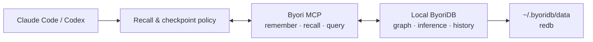

# Byori

> **Claude Code와 Codex가 프로젝트를 매번 처음부터 다시 배우지 않게 하는 로컬 지식 그래프.**

Byori는 코딩 에이전트가 작업 중 확정한 **모듈 구조, 결정과 근거, 반복되는 버그,
인시던트와 해결책**을 로컬 PC에 오래 보존하고 다음 세션에서 다시 탐색하게 만드는
로컬 AI 지식 관리 도구입니다. 그래프 엔진으로는 범용 semantic graph database인
[ByoriDB](https://github.com/byoridb/byoridb)를 설치·구동합니다.

목표는 LLM이 문서를 요약해 주는 평면 위키가 아닙니다. 프로젝트 지식을 typed node와
causal edge로 연결하고, 관계·시점·추론 근거를 따라가며 "무엇인가"뿐 아니라
**"왜 이렇게 되었는가"**까지 되짚는 시스템입니다.

> [!WARNING]
> 현재는 초기 실험 단계입니다. 로컬 단일 노드, MCP surface, 기본 notes schema는 구현되어
> 있습니다. 저장소 전체 자동 수집과 typed wiki 자동 부트스트랩은 아직 개발 중입니다.
> 중요한 데이터의 유일한 저장소로 사용하지 마세요.

## 구조: 3개 논리 계층

```text
Claude Code / Codex
        │  MCP + skill/hook adapter
        ▼
Byori (이 저장소)
├── 설치·업데이트·백업·제거        install.sh, templates/
├── MCP memory runtime            mcp/byoridb_mcp.py
├── agent adapter                 adapters/claude, adapters/codex(예정)
└── memory ontology + migration   docs/memory-ontology.md
        │  stable HTTP/gRPC contract (엔진 버전 고정)
        ▼
ByoriDB Core (byoridb/byoridb)
└── graph storage/query · ontology inference · temporal history · provenance
```

의존성 방향은 위에서 아래로만 흐릅니다. ByoriDB는 Byori를 모르고, Byori가 검증된
엔진 릴리스를 내려받아 설치·관리합니다.

## 문서형 LLM Wiki와 무엇이 다른가

| 문서형 위키 / RAG | Byori가 지향하는 방식 |
|---|---|
| 페이지와 요약을 검색 | module, decision, bug, incident를 typed graph로 연결 |
| 키워드·유사도 중심 recall | `GO`/`MATCH`로 원인, 영향, 대체 관계를 traversal |
| 최신 문서만 유지 | bitemporal history와 `AS OF`로 과거 상태 조회 |
| 결론을 텍스트로 저장 | 추론 edge의 provenance를 `WHY`로 설명 |
| 자유 추출로 중복이 쌓임 | 좁은 ontology와 canonical name으로 엔티티를 관리 |
| 외부 서비스에 의존 가능 | redb 기반 데이터와 MCP 서버를 로컬에 보관 |

예를 들어 다음 관계를 남기면 이후 에이전트는 증상만 검색하지 않고 원인과 해결 결정,
영향받은 모듈까지 한 흐름으로 탐색할 수 있습니다.

```text
incident ──caused_by──> bug ──fixed_by──> decision ──affects──> module
                                      └──supersedes──> previous decision
```

## 동작 방식



skill은 에이전트가 작업 시작 시 관련 기억을 조회하고, 결정·버그 해결·인시던트 종료 같은
체크포인트에서 durable knowledge를 기록하도록 안내합니다. MCP는 실제 읽기/쓰기 도구를
제공하고, hook은 그 시점을 상기시킵니다. 현재 hook은 **리마인더만 주입**하며 MCP를 직접
호출하지 않습니다. 기록 여부와 내용은 아직 에이전트가 판단합니다.

## 빠른 시작

사전 요구사항은 `curl`, `tar`, `python3`입니다. 사전 빌드 엔진 바이너리는 macOS
(Apple Silicon/Intel)와 Linux x86_64를 지원합니다.

### Byori Manager (macOS)

터미널 대신 설치형 앱을 사용하려면 릴리스의 `ByoriManager-*.dmg`를 열어
**Byori Manager.app**을 Applications로 드래그합니다. 앱에서 다음 작업을 각각
확인하고 실행할 수 있습니다.

- ByoriDB 설치·온라인 업데이트·시작·중지·재시작과 health/log 확인
- Claude Code와 Codex CLI 감지 및 공식 설치기를 통한 설치·업데이트
- 에이전트별 `byoridb` MCP 연결·해제
- `byoridb-memory` Skill 설치·업데이트·제거(변경 전 자동 백업)
- 창을 닫아도 메뉴 막대에서 상태 확인·새로고침·로그 열기와 창 다시 열기를 제공하는
  window/tray 하이브리드 동작
- 최대 200개 `note`와 `rel` 관계를 탐색하는 read-only 그래프 뷰

앱은 Claude/Codex 로그인 정보나 token을 읽지 않습니다. 소스 체크아웃에서 DMG를
만드는 방법과 Developer ID 서명 옵션은 [macOS Manager 문서](docs/manager-macos.md)를
참고합니다. 그래프는 초기 목록에서 본문을 제외하고 node를 선택할 때만 lazy-load합니다.

### Claude Code

```bash
curl -fsSL https://github.com/byoridb/byori/releases/latest/download/install.sh | bash

curl -s http://127.0.0.1:19669/health
claude mcp list
```

체크포인트 reminder hook도 설치하려면 `jq`를 준비한 뒤 다음처럼 실행합니다.

```bash
curl -fsSL https://github.com/byoridb/byori/releases/latest/download/install.sh \
  | bash -s -- --with-hooks
```

현재 installer의 hook merge는 기존 `SessionStart`/`PreToolUse` 배열을 교체할 수 있으므로
`~/.claude/settings.json`을 먼저 백업하세요.

설치 후 Claude Code를 재시작하세요. 서버·MCP·skill의 상세 위치, 옵션(`--engine-tag` 등),
제거 방법은 [설치 문서](docs/install.md)를 참고합니다.

### Codex

현재 설치기는 Codex를 자동 등록하지 않습니다. 기본 설치를 마친 뒤 MCP와 skill을
수동으로 연결합니다.

```bash
codex mcp add byoridb -- "$HOME/.byoridb/bin/run-mcp.sh"

mkdir -p "$HOME/.agents/skills/byoridb-memory"
cp "$HOME/.claude/skills/byoridb-memory/SKILL.md" \
  "$HOME/.agents/skills/byoridb-memory/SKILL.md"

codex mcp list
```

Codex를 재시작한 뒤 새 세션에서 사용합니다. Claude용 hook은 Codex에 설치되지 않습니다.

## Memory surface

| 도구 | 역할 |
|---|---|
| `memory_remember(name, kind, body, relates_to?)` | 안정적인 이름으로 note를 저장하거나 갱신 |
| `memory_recall(text?, kind?, limit?)` | note 이름·본문에서 이전 기억을 조회 |
| `memory_query(ngql)` | traversal, typed wiki, 집계, `AS OF`를 위한 raw nGQL |

현재 기본 설치는 독립적인 사실과 간단한 연결을 위한 `note`/`rel` schema를 생성합니다.
VID는 name의 sha1 해시를 비음수 63bit로 마스킹해 결정합니다(v0.1.1에서 음수 VID
INSERT 거부 버그 우회 — [엔진 계약](docs/engine-contract.md) 참조).
`module`, `decision`, `bug`, `incident`, `concept`, `task`와 typed edge로 구성된 causal wiki는
[memory ontology 설계와 PoC](docs/memory-ontology.md)에 검증되어 있지만, 새 설치에서 해당
schema를 자동 생성하는 작업은 남아 있습니다.

데이터 파일과 MCP process는 로컬에 머물지만, recall된 내용은 에이전트가 사용할 때
Claude/Codex의 model context로 전달될 수 있습니다. 비밀번호, token, credential 같은 secret은
memory에 저장하지 마세요.

## 엔진: ByoriDB

Byori 아래에는 범용 semantic graph database인
[ByoriDB](https://github.com/byoridb/byoridb)가 있습니다 — property graph와 nGQL,
선택된 RDFS-Plus/OWL 2 RL 규칙의 write-time materialization, inference provenance(`WHY`),
bitemporal history(`AS OF`), similarity recommendation을 제공합니다. 설치기는 이 저장소의
버전과 함께 검증된 엔진 릴리스를 고정 태그로 내려받으며(`--engine-tag`로 override),
엔진 기능 범위와 제약은 ByoriDB 저장소 문서를 참고합니다.

## 현재 한계

- 저장소, 문서, symbol, git diff를 자동으로 읽어 graph로 만드는 ingestion pipeline은 아직 없습니다.
- capture는 매 턴 자동 추출이 아니라 체크포인트에서 에이전트가 수행합니다.
- 기본 `memory_recall`은 note 이름·본문 substring 검색이며 엔진의 vector search를 사용하지 않습니다.
- typed wiki schema는 아직 원클릭 설치 대상이 아닙니다. shell installer의 Codex wiring은
  수동이지만 macOS Byori Manager에서는 MCP와 Skill을 각각 연결할 수 있습니다.
- 엔진 temporal v1의 공개 조회는 vertex `FETCH ... AS OF`에 한정되며 current/history dual-write는 비원자적입니다.

## 로드맵

`byori setup / doctor / connect / project add / backup / upgrade / rollback` 형태의 단일
CLI로 수렴하는 것이 목표입니다. 엔진 호환성은 [계약 문서](docs/engine-contract.md)와
CI 스모크로 게이트하며, memory schema versioning/migration, 프로젝트 registry와 자동
ingestion 순서로 진행합니다 — [docs/ROADMAP.md](docs/ROADMAP.md).

## 문서

- [설치·관리](docs/install.md)
- [Agent adapter 자산 (skill/hooks)](adapters/README.md)
- [Memory ontology 설계와 PoC](docs/memory-ontology.md)
- [로드맵](docs/ROADMAP.md)
- [ByoriDB 엔진](https://github.com/byoridb/byoridb)

## 라이선스

[Apache License 2.0](LICENSE)
