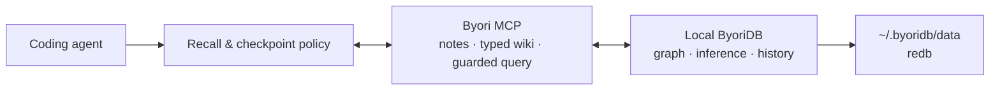

**English** | [한국어](docs/ko/README.md)

# Byori

> **A local knowledge graph that keeps coding agents from relearning your project from scratch every time.**

Byori is a local AI knowledge-management tool that preserves the **module structure,
decisions and rationale, recurring bugs, incidents, and resolutions** established by coding
agents during their work, so those agents can explore that knowledge again in later sessions.
It installs and runs [ByoriDB](https://github.com/byoridb/byoridb), a general-purpose
semantic graph database, as its graph engine.

The goal is not a flat wiki where an LLM summarizes documents. Byori connects project
knowledge through typed nodes and causal edges, then follows relationships, points in time,
and inference evidence to trace not only **what something is**, but **why it became that way**.

> [!WARNING]
> Byori is currently an early experiment. The local single-node setup, MCP surface, and
> schema v2 (notes plus the typed wiki) are implemented. Automatic ingestion of entire
> repositories is still under development. Do not use Byori as the only copy of important data.

## Architecture: three logical layers

```text
Claude Code / Codex / NaraeClaw
        │  MCP + skill/hook adapter
        ▼
Byori (this repository)
├── install · update · service · uninstall  install.sh, templates/
├── MCP memory runtime                      mcp/byoridb_mcp.py
├── agent adapters                          adapters/ (Claude/Codex + NaraeClaw reference)
└── memory ontology + migration             docs/memory-ontology.md
        │  pinned HTTP/nGQL contract
        ▼
ByoriDB Core (byoridb/byoridb)
└── graph storage/query · ontology inference · temporal history · provenance
```

Dependencies flow downward only. ByoriDB knows nothing about Byori; Byori downloads,
installs, and manages a validated engine release.

## How it differs from document-based LLM wikis

| Document wiki / RAG | What Byori aims for |
|---|---|
| Search pages and summaries | Connect modules, decisions, bugs, and incidents in a typed graph |
| Recall by keyword or similarity | Traverse causes, effects, and superseding relationships with `GO`/`MATCH` |
| Keep only the latest document | Query past states through bitemporal history and `AS OF` |
| Store conclusions as text | Explain the provenance of inferred edges with `WHY` |
| Accumulate duplicates through free-form extraction | Manage entities with a narrow ontology and canonical names |
| May depend on external services | Keep redb-backed data and the MCP server local |

For example, once the following relationships are recorded, future agents can explore the
cause, the decision that resolved it, and the affected module as one chain instead of searching
for the symptom alone.

```text
incident ──caused_by──> bug ──fixed_by──> decision ──affects──> module
                                      └──supersedes──> previous decision
```

## How it works


```mermaid
flowchart LR
    A[Coding agent] --> B[Recall & checkpoint policy]
    B <--> C[Byori MCP<br/>notes · typed wiki · guarded query]
    C <--> D[Local ByoriDB<br/>graph · inference · history]
    D --> E[~/.byoridb/data<br/>redb]
```

The skill tells the agent to retrieve relevant memories when work begins and to record
durable knowledge at checkpoints such as decisions, bug fixes, and incident closure. MCP
provides the actual read/write tools. When requested at installation, the optional Claude Code
hook reminds the agent around session start and commit checkpoints. It **only injects reminders**;
it does not call MCP directly. The agent still decides what to record and whether to record it.

## Preliminary benchmark (dogfood)

> [!NOTE]
> These results come from **one run per condition** against a single synthetic repository
> (five questions × two conditions, using headless `claude -p`). They are dogfood numbers
> intended to show the direction of the effect, not a statistically rigorous measurement.
> Absolute results can vary substantially by model, project, and question.

We recorded five pieces of knowledge from previous sessions in Byori—decisions, bugs,
incidents, and abandoned work—then asked about that knowledge, which was **not present in the
code**, in one session connected to Byori and another without Byori.

| Metric | Connected to Byori | Not connected (baseline) |
|---|---|---|
| Average elapsed time | **≈40 sec** | ≈125 sec |
| Average cost | **≈$0.43** | ≈$1.15 |
| Average turns | **≈5** | ≈15 |
| Knowledge recovered despite being absent from the code | 20/20 | 0/20 |

For every question, the unconnected session had to rediscover the codebase through `git log`,
grep, and close reading. Time, cost, and turns grew by roughly 3×. It also could not structurally
recover knowledge absent from the code—such as “why was this value chosen?”, “what incident
happened before?”, or “what work was abandoned?”—and answered that no record existed.

**Memory does not replace reading the code.** In this experiment, the unconnected session dug
deep enough to find a real source defect, while the connected session trusted recall and moved
on without closely reading that file. The best of both approaches is to verify the relevant
code even after recall provides an answer.

## Quick start

Prerequisites are `curl`, `tar`, and `python3`. Prebuilt engine binaries support macOS
(Apple Silicon and Intel) and Linux x86_64.

### Byori Manager (macOS)

You can use an installable app instead of the terminal. The app lets you inspect and run each
of the following operations:

- Install ByoriDB, apply online updates, start, stop, and restart it, and inspect its health and logs
- Detect the Claude Code and Codex CLIs, then install or update them through their official installers
- Connect or disconnect the `byoridb` MCP server for each agent
- Install, update, or remove the `byoridb-memory` Skill, with an automatic backup before changes
- Keep status, refresh, log access, and window reopening available from the menu bar after the
  window closes, using a hybrid window/tray model
- Explore up to 200 note/typed-wiki nodes and 500 rel/typed edges in a read-only graph view

The app does not read Claude or Codex login details or tokens. The graph excludes bodies from
the initial list and lazy-loads a body only when you select a node.

#### For now, build it from source

> [!NOTE]
> There is no officially signed and notarized `.dmg` release yet. Developer ID signing requires
> an Apple Developer Program membership; once signing is available, we will ship one.
> Until then, roll your own with the commands below—the app runs locally and works just fine
> without a signature.

All you need is macOS and Xcode Command Line Tools.

```bash
git clone https://github.com/byoridb/byori.git && cd byori
VERSION=0.2.0-dev scripts/build-macos-dmg.sh    # creates .app and .dmg in dist/ (ad-hoc signed)
open "dist/Byori Manager.app"                   # launch immediately
```

See the [macOS Manager documentation](docs/manager-macos.md) for build options such as
`--universal` for a combined Intel + Apple Silicon build and `--sign` for Developer ID signing,
as well as the notarization procedure. An unsigned development build opens without trouble on
your own Mac, but Gatekeeper will give it the side-eye if you hand it to someone else. Once a
properly signed DMG is available in Releases, just open it and drag the app into Applications.

### Claude Code

```bash
curl -fsSL https://github.com/byoridb/byori/releases/latest/download/install.sh | bash

curl -s http://127.0.0.1:19669/health
claude mcp list
```

To install the checkpoint reminder hook as well, make sure `jq` is available and run:

```bash
curl -fsSL https://github.com/byoridb/byori/releases/latest/download/install.sh \
  | bash -s -- --with-hooks
```

The hook merge appends to the existing `SessionStart` and `PreToolUse` arrays, skipping entries
that already exist, and writes a `~/.claude/settings.json.bak.<timestamp>` backup before making
changes.

Restart Claude Code after installation. See the [installation documentation](docs/install.md)
for the exact server, MCP, and skill locations, options such as `--engine-tag`, and removal
instructions.

### Codex

When the installer detects the `codex` CLI, it automatically registers MCP and installs the
skill under `~/.agents/skills/`; pass `--no-codex` to skip this. Restart Codex, verify the setup
with `codex mcp list`, and use it in a new session. The Claude hook is not installed for Codex.
See the [installation documentation](docs/install.md) for manual connection instructions.

### NaraeClaw (reference adapter)

The installer does not configure NaraeClaw automatically. Register a separate MCP process with
`BYORIDB_MCP_PROFILE=safe` and a stable per-project `BYORIDB_MEMORY_SPACE`, then install the
reference skill from `adapters/naraeclaw/` using NaraeClaw's normal skill mechanism. See the
[adapter documentation](adapters/README.md) for the command and isolation rules.

## Memory surface

| Tool | Purpose |
|---|---|
| `memory_remember(name, kind?, body, relates_to?)` | Store or update a note under a stable name |
| `memory_recall(text?, kind?, limit?)` | Retrieve previous memories by note name and body |
| `memory_wiki_upsert(type, name, body, state?, resolved?)` | Create or update a validated typed-wiki node; the server resolves its VID |
| `memory_link(action?, relation, source, target)` | Create/update or delete a validated relationship between existing nodes |
| `memory_read(type?, name?, text?, limit?, include_links?)` | Read normalized notes and typed-wiki nodes; VIDs are decimal strings |
| `memory_delete(type, name, cascade?)` | Delete one exact node, requiring explicit cascade when links exist |
| `memory_export(limit?, offset?, include_links?)` | Export a bounded best-effort inspection page; deep pagination is not a backup |
| `memory_query_read(ngql)` | Run one validated read-only `MATCH`/`FETCH`/`GO`/`LOOKUP`/`SHOW`/`WHY` statement |
| `memory_query(ngql)` | Legacy unrestricted raw nGQL escape hatch; hidden and blocked in the `safe` profile |

The default `safe` MCP profile removes `memory_query` from discovery and dispatch. Existing users
who explicitly require the unrestricted compatibility escape hatch can opt into
`BYORIDB_MCP_PROFILE=legacy`; note writes and validated structured CRUD remain available in both
profiles.
Use a stable `BYORIDB_MEMORY_SPACE` matching `^[A-Za-z_][A-Za-z0-9_]{0,63}$` to avoid accidental
mixing between clients or projects. A space is a logical namespace, not an authorization boundary;
separate trust domains require separate instances and credentials. See the
[engine contract](docs/engine-contract.md) for input limits and the exact profile boundary.

At startup, the MCP server automatically migrates the space to the current memory schema (v2).
It bootstraps both the `note`/`rel` layer for standalone facts and the typed-wiki layer made up
of `module`/`decision`/`bug`/`incident`/`concept`/`entity`/`task` plus causal edges. See the
[memory ontology design and PoC](docs/memory-ontology.md). The applied schema version is recorded
in the `byori:schema-version` note. New nodes derive a VID by masking the SHA-1 hash of the name to
a non-negative 63-bit value. Existing canonical typed nodes created with the v0.2.0 60-bit recipe
are found by name and keep their original VID, preventing duplicate nodes during upgrades. The
non-negative rule was introduced in Byori v0.1.1 to work around the pinned engine's negative-VID
INSERT rejection; see the [engine contract](docs/engine-contract.md).

The data files and MCP process remain local, but recalled content may be sent to an agent's model
context when it uses the tools. Do not store secrets such as passwords, tokens, or credentials
in memory.

## Engine: ByoriDB

Under Byori is [ByoriDB](https://github.com/byoridb/byoridb), a general-purpose semantic graph
database. It provides property graphs and nGQL, write-time materialization for selected
RDFS-Plus/OWL 2 RL rules, inference provenance through `WHY`, bitemporal history through
`AS OF`, and similarity recommendations. The installer downloads an engine release validated
with this repository's version and pins it by tag; use `--engine-tag` to override it. See the
ByoriDB repository documentation for the engine's feature set and constraints.

## Current limitations

- There is no ingestion pipeline yet that automatically turns repositories, documents, symbols, and git diffs into a graph.
- Capture is performed by the agent at checkpoints rather than extracted automatically on every turn.
- The default `memory_recall` searches substrings in note names and bodies; it does not use the engine's vector search.
- There is no checkpoint hook for Codex or NaraeClaw; the bundled reminder hook is Claude Code-only.
- Public queries in engine temporal v1 are limited to vertex `FETCH ... AS OF`, and current/history dual writes are non-atomic.

## Roadmap

The goal is to converge on a single CLI shaped like
`byori setup / doctor / connect / project add / backup / upgrade / rollback`. Engine compatibility
is gated by the [contract](docs/engine-contract.md) and a CI smoke test. With the Manager and
additive schema v2 migrations in place, the remaining sequence is the shared CLI and explicit
destructive migrations, then a project registry, then automatic ingestion—see
[docs/ROADMAP.md](docs/ROADMAP.md).

## Documentation

English is the canonical documentation language. Korean translations live under `docs/ko/`
and are linked from every translated page. Executable adapter skills remain English-only; the
quoted Korean phrases in the Claude/Codex skill are intentional multilingual trigger examples.

- [Installation and management](docs/install.md)
- [macOS Manager](docs/manager-macos.md)
- [Agent adapter assets (skill/hooks)](adapters/README.md)
- [Memory ontology design and PoC](docs/memory-ontology.md)
- [ByoriDB engine compatibility contract](docs/engine-contract.md)
- [Roadmap](docs/ROADMAP.md)
- [ByoriDB engine](https://github.com/byoridb/byoridb)

## License

[Apache License 2.0](LICENSE)
