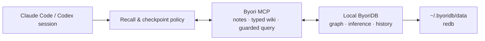

**English** | [한국어](docs/ko/README.md)

# Byori

<p align="center">
  
</p>

> **A project-first native multi-agent coding workspace with shared ByoriDB context.**

Byori is a project-first native multi-agent coding workspace. Organize local Git work as
**Project → Source Tree/Worktree → Task → Session**, then choose Claude Code or Codex for each
interactive terminal session. The user decides where each agent works and opens another session
when another agent is useful; Byori does not automatically fan out a prompt, select a winner,
merge branches, or delete agent work.

[ByoriDB](https://github.com/byoridb/byoridb) is the durable knowledge engine beneath the
workspace. It keeps project decisions and rationale, module relationships, recurring bugs,
incidents, resolutions, and task checkpoints available across agents and sessions. **Byori** is
the product, **ByoriDB** is its graph engine, and **`byori`** is the command-line interface.

> [!WARNING]
> Byori is currently an early experiment. The native macOS workspace MVP, real interactive PTY,
> local single-node ByoriDB setup, MCP surface, schema v2 (notes plus the typed wiki), and a
> separate foreground multi-CLI prototype are implemented. The app cannot reattach terminal
> sessions after a full quit, and automatic repository ingestion is still under development.
> Do not use Byori as the only copy of important data.

## Workspace model

```text
Project
├── Source Tree (registered Git root)
│   └── Task
│       ├── Session — Claude Code · real interactive PTY
│       └── Session — Codex       · real interactive PTY
└── Worktree (discovered linked checkout)
    └── Task
        └── Session — user-selected agent and launch model
```

The left outline keeps this hierarchy visible. Selecting a session opens its terminal in the
center; the right inspector shows bounded Files and Git views plus project-scoped ByoriDB
Context. ByoriDB and CLI installation, per-agent MCP and Memory Skill connections, maintenance,
backups, and diagnostics are supporting operations under **Settings**, not the main navigation.

Removing a project or linked checkout from the outline is non-destructive. A project registration
is archived and can be restored by adding the same canonical repository again; a linked checkout
is hidden until restored. Neither action deletes repository files, Git worktrees or branches,
task/session metadata, or ByoriDB data.

## Architecture

```text
Byori
├── macOS app
│   ├── project/source-tree/worktree/task/session workspace
│   ├── real Claude Code or Codex PTY selected per session
│   ├── Files · Git · project-scoped ByoriDB Context
│   └── Settings for agents, Skills, MCP, ByoriDB, and diagnostics
├── `byori` foreground CLI prototype                    cli/byori.py
└── integration layer (this repository)
    ├── MCP memory runtime                              mcp/byoridb_mcp.py
    ├── agent adapters                                  adapters/
    └── install · service · ontology migration          install.sh, templates/
            │
            ├── Claude Code / Codex vendor CLIs (authentication stays vendor-owned)
            │
            └── pinned HTTP/nGQL contract
                    ▼
                ByoriDB
                └── graph query · inference · history · provenance
```

Dependencies flow downward only. ByoriDB knows nothing about Byori; Byori installs and manages a
validated engine release. Raw terminal prompts and transcripts are not stored in ByoriDB.

## Quick start

### Byori macOS app

The primary product surface is the native macOS app. Register a trusted Git project, select its
source tree or an existing linked worktree, create a task, and open a session with Claude Code or
Codex. You can use the provider's CLI-default model or enter an exact launch model identifier.
Byori records that launch selection; provider-side model changes made inside the interactive CLI
remain outside Byori's observation.

The app discovers existing Git worktrees but does not create them yet. It also does not broadcast
one prompt to several agents, compare their patches, select a winner, merge, or clean up worktrees.
Create another session explicitly when you want another agent.

Closing the workspace window keeps its PTYs alive only while the menu bar app process continues
running. Quitting Byori stops those sessions; the app cannot reattach to or automatically resume
them after a full quit. Prompts are entered directly in the terminal and are not stored by Byori.
The app does not read Claude Code or Codex login details or tokens.

#### Build from source for now

> [!NOTE]
> There is no officially signed and notarized `.dmg` release yet. Developer ID signing requires
> an Apple Developer Program membership. Until a signed build is available, build the app locally
> with Xcode Command Line Tools.

```bash
git clone https://github.com/byoridb/byori.git && cd byori
VERSION=0.2.0-dev scripts/build-macos-dmg.sh    # creates dist/Byori.app and a .dmg
open "dist/Byori.app"
```

See the [Byori macOS app documentation](docs/manager-macos.md) for build options such as
`--universal` and `--sign`, plus notarization instructions. An ad-hoc-signed development build is
appropriate for local testing; sharing it with another Mac may require Gatekeeper workarounds
until an officially signed release is available.

### `byori` foreground CLI prototype

Prerequisites are `curl`, `tar`, and `python3`. Prebuilt ByoriDB binaries support macOS
(Apple Silicon and Intel) and Linux x86_64.

The installer includes a separate compatibility prototype that can run supported coding CLIs in
the foreground. A single-agent run is explicit:

```bash
curl -fsSL https://github.com/byoridb/byori/releases/latest/download/install.sh | bash
export PATH="$HOME/.byoridb/bin:$PATH"

byori provider list
cd /path/to/a/git/repository
byori project add .
byori run --agent claude "implement the requested change"
byori runs list
```

Repeating `--agent` explicitly requests multiple concurrent workers; omitting it launches every
installed supported provider. In the default mode each worker gets a managed branch and Git
worktree, and the registered repository must be clean. The coordinator never merges or deletes
worker results automatically. This foreground fan-out command is a prototype, not the native
workspace interaction model. See [multi-CLI orchestration](docs/orchestration.md) for
`--in-place`, `--no-memory`, `--allow-shell`, timeouts, run records, and security boundaries.

### Connect coding agents to ByoriDB

#### Claude Code

```bash
curl -fsSL https://github.com/byoridb/byori/releases/latest/download/install.sh | bash

curl -s http://127.0.0.1:19669/health
claude mcp list
```

To install the checkpoint reminder hook as well, make sure `jq` is available and run:

```bash
curl -fsSL https://github.com/byoridb/byori/releases/latest/download/install.sh \
  | bash -s -- --with-hooks
```

The hook merge appends to the existing `SessionStart` and `PreToolUse` arrays, skipping entries
that already exist, and writes a `~/.claude/settings.json.bak.<timestamp>` backup before making
changes. Restart Claude Code after installation. See the
[installation documentation](docs/install.md) for exact locations and removal instructions.

#### Codex

When the installer detects `codex`, it registers the MCP server and installs the
`byoridb-memory` and `byori-design` Skills under `~/.agents/skills/`; pass `--no-codex`
to skip this. Restart Codex, verify with `codex mcp list`, and use it in a new session.
The Claude reminder hook is not installed for Codex.

#### NaraeClaw (reference adapter)

The installer does not configure NaraeClaw automatically. Register a separate MCP process with
`BYORIDB_MCP_PROFILE=safe` and a stable per-project `BYORIDB_MEMORY_SPACE`, then install the
reference Skill from `adapters/naraeclaw/`. See the
[adapter documentation](adapters/README.md) for the command and isolation rules.

## ByoriDB knowledge layer

ByoriDB is not a flat wiki where an LLM summarizes documents. The Byori memory layer connects
project knowledge through typed nodes and causal edges, then follows relationships, points in
time, and inference evidence to trace not only **what something is**, but **why it became that
way**.

### How it works


```mermaid
flowchart LR
    A[Claude Code / Codex session] --> B[Recall & checkpoint policy]
    B <--> C[Byori MCP<br/>notes · typed wiki · guarded query]
    C <--> D[Local ByoriDB<br/>graph · inference · history]
    D --> E[~/.byoridb/data<br/>redb]
```

The `byoridb-memory` Skill tells an agent to retrieve relevant memories when work begins and to
record durable knowledge at checkpoints such as decisions, bug fixes, and incident closure.
The `byori-design` Skill applies the same continuity to product and UX/UI work, coordinating
repository-native design artifacts with durable Byori context.
MCP provides the actual read/write tools. The optional Claude Code hook only injects reminders;
it does not call MCP directly. The agent still decides what to record and whether to record it.

### How it differs from document-based LLM wikis

| Document wiki / RAG | What Byori aims for |
|---|---|
| Search pages and summaries | Connect modules, decisions, bugs, and incidents in a typed graph |
| Recall by keyword or similarity | Traverse causes, effects, and superseding relationships with `GO`/`MATCH` |
| Keep only the latest document | Query past states through bitemporal history and `AS OF` |
| Store conclusions as text | Explain the provenance of inferred edges with `WHY` |
| Accumulate duplicates through free-form extraction | Manage entities with a narrow ontology and canonical names |
| May depend on external services | Keep redb-backed data and the MCP server local |

For example, once the following relationships are recorded, future agents can explore the
cause, the decision that resolved it, and the affected module as one chain instead of searching
for the symptom alone.

```text
incident ──caused_by──> bug ──fixed_by──> decision ──affects──> module
                                      └──supersedes──> previous decision
```

### Preliminary benchmark (dogfood)

> [!NOTE]
> These results come from **one run per condition** against a single synthetic repository
> (five questions × two conditions, using headless `claude -p`). They are dogfood numbers
> intended to show the direction of the effect, not a statistically rigorous measurement.
> Absolute results can vary substantially by model, project, and question.

We recorded five pieces of knowledge from previous sessions in Byori—decisions, bugs,
incidents, and abandoned work—then asked about that knowledge, which was **not present in the
code**, in one session connected to Byori and another without Byori.

| Metric | Connected to Byori | Not connected (baseline) |
|---|---|---|
| Average elapsed time | **≈40 sec** | ≈125 sec |
| Average cost | **≈$0.43** | ≈$1.15 |
| Average turns | **≈5** | ≈15 |
| Knowledge recovered despite being absent from the code | 20/20 | 0/20 |

For every question, the unconnected session had to rediscover the codebase through `git log`,
grep, and close reading. Time, cost, and turns grew by roughly 3×. It also could not structurally
recover knowledge absent from the code—such as “why was this value chosen?”, “what incident
happened before?”, or “what work was abandoned?”—and answered that no record existed.

**Memory does not replace reading the code.** In this experiment, the unconnected session dug
deep enough to find a real source defect, while the connected session trusted recall and moved
on without closely reading that file. The best of both approaches is to verify the relevant
code even after recall provides an answer.

## Memory surface

| Tool | Purpose |
|---|---|
| `memory_remember(name, kind?, body, relates_to?)` | Store or update a note under a stable name |
| `memory_recall(text?, kind?, limit?)` | Retrieve previous memories by note name and body |
| `memory_wiki_upsert(type, name, body, state?, resolved?)` | Create or update a validated typed-wiki node; the server resolves its VID |
| `memory_link(action?, relation, source, target)` | Create/update or delete a validated relationship between existing nodes |
| `memory_read(type?, name?, text?, limit?, include_links?)` | Read normalized notes and typed-wiki nodes; VIDs are decimal strings |
| `memory_delete(type, name, cascade?)` | Delete one exact node, requiring explicit cascade when links exist |
| `memory_export(limit?, offset?, include_links?)` | Export a bounded best-effort inspection page; deep pagination is not a backup |
| `memory_query_read(ngql)` | Run one validated read-only `MATCH`/`FETCH`/`GO`/`LOOKUP`/`SHOW`/`WHY` statement |
| `memory_query(ngql)` | Legacy unrestricted raw nGQL escape hatch; hidden and blocked in the `safe` and `readonly` profiles |

The default `legacy` MCP profile keeps `memory_query` for backward compatibility. New integrations
that do not need unrestricted raw mutation should run with `BYORIDB_MCP_PROFILE=safe`: it removes
only the raw-query tool, while note writes and validated structured CRUD remain available.
The `readonly` profile used by orchestrated workers exposes only the four read tools. It is a tool
filter rather than an authorization sandbox: it keeps the configured engine credential, performs
only login/`USE`/schema-version reads at startup, and fails if a writer has not prepared the current
schema.
Use a stable `BYORIDB_MEMORY_SPACE` matching `^[A-Za-z_][A-Za-z0-9_]{0,63}$` to avoid accidental
mixing between clients or projects. A space is a logical namespace, not an authorization boundary;
separate trust domains require separate instances and credentials. See the
[engine contract](docs/engine-contract.md) for input limits and the exact profile boundary.

At startup, writer profiles automatically migrate the space to the current memory schema (v2);
`readonly` only checks that version. The writer bootstrap creates both the `note`/`rel` layer for
standalone facts and the typed-wiki layer made up
of `module`/`decision`/`bug`/`incident`/`concept`/`entity`/`task` plus causal edges. See the
[memory ontology design and PoC](docs/memory-ontology.md). The applied schema version is recorded
in the `byori:schema-version` note. New nodes derive a VID by masking the SHA-1 hash of the name to
a non-negative 63-bit value. Existing canonical typed nodes created with the v0.2.0 60-bit recipe
are found by name and keep their original VID, preventing duplicate nodes during upgrades. The
non-negative rule was introduced in Byori v0.1.1 to work around the pinned engine's negative-VID
INSERT rejection; see the [engine contract](docs/engine-contract.md).

The data files and MCP process remain local, but recalled content may be sent to an agent's model
context when it uses the tools. Do not store secrets such as passwords, tokens, or credentials
in memory.

## Engine: ByoriDB

Under Byori is [ByoriDB](https://github.com/byoridb/byoridb), a general-purpose semantic graph
database. It provides property graphs and nGQL, write-time materialization for selected
RDFS-Plus/OWL 2 RL rules, inference provenance through `WHY`, bitemporal history through
`AS OF`, and similarity recommendations. The installer downloads an engine release validated
with this repository's version and pins it by tag; use `--engine-tag` to override it. See the
ByoriDB repository documentation for the engine's feature set and constraints.

## Current limitations

- There is no ingestion pipeline yet that automatically turns repositories, documents, symbols, and git diffs into a graph.
- Capture is performed by the agent at checkpoints rather than extracted automatically on every turn.
- The default `memory_recall` searches substrings in note names and bodies; it does not use the engine's vector search.
- There is no checkpoint hook for Codex or NaraeClaw; the bundled reminder hook is Claude Code-only.
- The macOS app discovers existing linked worktrees but does not create them, and its PTYs cannot
  be reattached after the app process exits.
- Multi-CLI orchestration is a foreground local MVP; it does not yet provide a daemon, remote UI,
  automatic patch comparison, merge, or worktree cleanup.
- Public queries in engine temporal v1 are limited to vertex `FETCH ... AS OF`, and current/history dual writes are non-atomic.

## Roadmap

The native project workspace is the primary product surface. The separate cross-platform `byori`
CLI prototype covers provider discovery, trusted project registration, explicit foreground runs,
and run inspection; its management commands will converge with the Byori macOS app's shared core.
Automatic ingestion and ranked graph recall remain future work. Engine compatibility is gated by
the [contract](docs/engine-contract.md) and a CI smoke test; see
[docs/ROADMAP.md](docs/ROADMAP.md).

## Documentation

English is the canonical documentation language. Korean translations live under `docs/ko/`
and are linked from every translated page. Executable adapter skills remain English-only; the
quoted Korean phrases in the Claude/Codex skill are intentional multilingual trigger examples.

- [Installation and management](docs/install.md)
- [Multi-CLI orchestration](docs/orchestration.md)
- [Byori macOS app](docs/manager-macos.md)
- [Agent adapter assets (skill/hooks)](adapters/README.md)
- [Memory ontology design and PoC](docs/memory-ontology.md)
- [ByoriDB engine compatibility contract](docs/engine-contract.md)
- [Roadmap](docs/ROADMAP.md)
- [ByoriDB engine](https://github.com/byoridb/byoridb)

## License

[Apache License 2.0](LICENSE)
