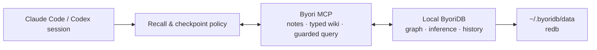

[English](../../README.md) | **한국어**

# Byori

<p align="center">
  
</p>

> **당신 소프트웨어 프로젝트의 기억.**
>
> Git은 무엇이 바뀌었는지 기억합니다. Byori는 왜 그렇게 됐는지 기억합니다.

모든 코딩 에이전트는 잊습니다. 프로젝트는 잊으면 안 됩니다.

```text
$ byori init                       # 저장소의 히스토리를 읽는다
analyzed
  11,814 commits · 1,858 tracked files · 1,042 pull requests
discovered
  module 24 · bug 72 · task 64 · decision 19 · relations 453
```

```text
$ 에이전트에게: "sendfile은 왜 replication에서 사라졌어?"

Byori 없이   "현재 구현만 볼 수 있습니다. 여기에 sendfile 코드가 없으니
              애초에 있었는지도 말할 수 없습니다."

Byori와      bug:redis-revert-61074b43   (evidence-backed)
             2020-06-06에 되돌림: "Implements sendfile for redis."
               (commit 9cf500a3f67e)
             revert는 그 변경이 잘못이었다는 히스토리의 진술이며,
             왜 잘못이었는지는 커밋에 없으므로 기록하지 않습니다.
```

**redis 전체 히스토리에서 그래프와 함께 8/8, 빈 그래프로 0/8.** 통과 기준은 답이 열어볼 수 있는
커밋이나 PR을 인용했는지입니다. ingest는 11초였습니다. 재현: [`benchmarks/why.py`](../../benchmarks/why.py).

Byori는 요약 더미가 아니라 이 사슬을 보존합니다:

```text
incident ──caused_by──> bug ──fixed_by──> decision ──affects──> module
                                      └──supersedes──> previous decision
```

벡터 검색은 비슷한 문단을 찾아 주지만, 이 구조는 이유를 찾아 주고 **무엇에 근거했는지 말합니다.**
모든 기억은 `evidence-backed` 또는 `unsourced`로 표시되고, 더 새로운 것이 대체한 결정은 `stale`로
돌아옵니다 — 확인할 수 없는 기억은 커밋을 인용하는 기억보다 값이 낮고, 작년 결정을 현재처럼
답하는 것은 답이 없는 것보다 나쁘기 때문입니다.

## 무엇으로 이루어져 있나

| | |
|---|---|
| **`byori init`** | Git만으로 시작 그래프를 만듭니다 — 이슈 트레일러·revert·PR·ADR·디렉터리 트리. 결정론입니다: 모델도, 추측한 인과도 없고, 각 기억의 근거가 된 커밋·문서를 함께 기록합니다. |
| **`memory_why`** | 어떤 에이전트든 호출하는 MCP 도구. **서버가** 답을 조립합니다 — 원인, 무엇이 해결했는지, 무엇을 대체했고 무엇에 의해 대체됐는지, 증거. 모델이 증거를 요약으로 지울 자리가 없습니다. |
| **ByoriDB** | 아래에 있는 로컬 그래프 엔진: 타입 있는 인과 엣지, provenance, bitemporal 히스토리, `AS OF`. |
| **워크스페이스** | Claude Code·Codex·평범한 터미널을 프로젝트별 기억 위에서 돌리는 macOS 앱. 그래프가 계속 쓰이게 하기 위해 존재하며, 그것이 제품의 핵심은 아닙니다. |
| **`byori doctor`** | 엔진·서비스·자격증명·이 프로젝트의 기억·에이전트 배선을 점검하고, 실패한 것을 되돌리는 명령을 출력합니다. |

## Byori는 무엇인가

Byori는 프로젝트 중심의 네이티브 멀티 에이전트 코딩 워크스페이스입니다. 로컬 Git 작업을
**Project → Source Tree/Worktree → Task → Session**으로 구성하고, 각 대화형 터미널 세션에
Claude Code 또는 Codex를 선택합니다. 어떤 소스트리에서 어떤 에이전트를 사용할지는 사용자가
결정합니다. Byori가 프롬프트를 자동 fan-out하거나 winner를 고르고, branch를 merge하거나
에이전트 작업을 삭제하지 않습니다.

[ByoriDB](https://github.com/byoridb/byoridb)는 워크스페이스 하단의 영속 지식 엔진입니다.
프로젝트의 결정과 근거, 모듈 관계, 반복 버그, 인시던트, 해결책, 작업 체크포인트를 에이전트와
세션 사이에서 이어 줍니다. **Byori**는 제품, **ByoriDB**는 그래프 엔진, **`byori`**는 CLI입니다.

지식은 매 턴에서 자동 추출되는 것이 아니라 에이전트가 체크포인트에서 기록합니다. 따라서
그래프는 설치 직후가 아니라 작업하면서 자랍니다. 저장소 자동 ingestion은 아직 개발
중입니다. [현재 한계](#현재-한계)를 참고하세요.

> [!WARNING]
> 현재는 초기 실험 단계입니다. 네이티브 macOS 워크스페이스 MVP, 실제 대화형 PTY,
> 로컬 단일 노드 ByoriDB, MCP surface, notes + typed wiki schema v2, 별도의 foreground
> 멀티 CLI 프로토타입은 구현되어 있습니다. 터미널 세션 유지는 tmux 3.2 이상이 필요하며,
> 없으면 앱과 함께 종료됩니다. 저장소 자동 ingestion도 아직 개발 중입니다. 중요한 데이터의 유일한
> 저장소로 사용하지 마세요.

## 워크스페이스 모델

```text
Project
├── Source Tree (등록한 Git root)
│   └── Task
│       ├── Session — Claude Code · 실제 대화형 PTY
│       └── Session — Codex       · 실제 대화형 PTY
└── Worktree (탐색된 linked checkout)
    └── Task
        └── Session — 사용자가 agent와 launch model 선택
```

왼쪽 outline은 이 계층을 계속 보여 줍니다. 세션을 선택하면 가운데에 해당 terminal이 열리고,
오른쪽 inspector에는 제한된 Files/Git 정보와 프로젝트 범위 ByoriDB Context가 나타납니다.
ByoriDB·CLI 설치, 에이전트별 MCP/Memory Skill 연결, 유지관리, 백업, 진단은 메인 내비게이션이
아닌 **Settings**의 지원 기능입니다.

프로젝트나 linked checkout을 outline에서 제거해도 실제 데이터는 삭제하지 않습니다. 프로젝트
등록은 archive되어 같은 canonical repository를 다시 추가하면 복원되고, checkout은 복원할
때까지 숨겨집니다. 저장소 파일, Git worktree/branch, task/session metadata, ByoriDB 데이터는
삭제하지 않습니다.

## 아키텍처

```text
Byori
├── macOS 앱
│   ├── project/source-tree/worktree/task/session 워크스페이스
│   ├── 세션마다 선택한 실제 Claude Code 또는 Codex PTY
│   ├── Files · Git · 프로젝트 범위 ByoriDB Context
│   └── agent · Skill · MCP · ByoriDB · diagnostics Settings
├── `byori` foreground CLI 프로토타입                 cli/byori.py
└── 통합 계층 (이 저장소)
    ├── MCP memory runtime                            mcp/byoridb_mcp.py
    ├── agent adapter                                 adapters/
    └── 설치 · service · ontology migration           install.sh, templates/
            │
            ├── Claude Code / Codex vendor CLI (인증은 vendor 소유)
            │
            └── 고정된 HTTP/nGQL contract
                    ▼
                ByoriDB
                └── graph query · inference · history · provenance
```

의존성은 위에서 아래로만 흐릅니다. ByoriDB는 Byori를 모르고, Byori가 검증된 엔진 릴리스를
설치·관리합니다. 터미널의 raw prompt와 transcript는 ByoriDB에 저장하지 않습니다.

## 빠른 시작

### 0에서 기억하는 프로젝트까지

```bash
# 1. 런타임 설치 (엔진·MCP 서버·CLI·스킬·체크포인트 훅)
curl -fsSL https://github.com/byoridb/byori/releases/latest/download/install.sh | bash

# 2. 이 프로젝트의 기억을 히스토리로 만든다
cd ~/code/your-project
~/.byoridb/bin/byori init

# 3. 에이전트에게 왜 그런지 물어본다
#    (설치기가 Claude Code와 Codex를 연결해 둡니다)

# 뭔가 이상할 때
~/.byoridb/bin/byori doctor
```

`byori init`은 결정론이고 재실행이 안전합니다 — Git만 읽고 모델은 쓰지 않으며, 이미 쓴 기억은
중복이 아니라 갱신됩니다. `byori doctor`는 엔진·서비스·자격증명·이 프로젝트의 기억·에이전트
배선을 점검하고 실패한 것을 되돌리는 명령을 출력합니다.

macOS 앱에서는 그 부재가 보이는 자리에 같은 기능이 있습니다 — Context 탭이 빈 프로젝트에
**히스토리로 기억 만들기**가 나타나고, 모든 프로젝트 행의 컨텍스트 메뉴에도 있습니다.


### Byori macOS 앱

핵심 제품 화면은 네이티브 macOS 앱입니다. 신뢰하는 Git 프로젝트를 등록하고 source tree 또는
기존 linked worktree를 선택한 뒤 task를 만들고 Claude Code나 Codex 세션을 엽니다. provider의
CLI 기본 model을 사용하거나 정확한 launch model identifier를 입력할 수 있습니다. Byori는
이 launch 선택을 기록하지만 대화형 CLI 안에서 일어난 provider-side model 변경은 관찰하지
않습니다.

#### 앱 설치

[최신 릴리스](https://github.com/byoridb/byori/releases/latest)에서
`Byori-<version>-universal.dmg`를 내려받아 열고 **Byori**를 Applications로 끌어다 놓으세요.
이 DMG는 Developer ID Application 인증서로 서명하고 Apple 공증과 staple을 마쳤으므로 Gatekeeper
우회 없이 열립니다. universal 빌드 하나가 Apple Silicon과 Intel을 모두 지원하며, 앱은 macOS 13
이상이 필요합니다.

설치 전에 직접 확인하려면:

```bash
spctl -a -vvv -t open --context context:primary-signature ~/Downloads/Byori-*-universal.dmg
# accepted
# source=Notarized Developer ID
```

이후 업데이트는 앱이 처리합니다. **Settings → 설정 개요**가 설치된 버전을 보고하고, 새 릴리스의
Developer ID 서명과 Apple 공증을 확인한 뒤에만 교체하며 어느 하나라도 실패하면 설치하지 않습니다.
교체를 위해 앱이 한 번 종료되므로, tmux로 유지되지 않는 세션은 먼저 종료하도록 요청합니다.

ByoriDB는 별도 설치입니다. 앱의 **Settings → ByoriDB**를 쓰거나 아래 한 줄 설치기를 사용하세요.

<details>
<summary>대신 소스에서 빌드하기</summary>

Xcode Command Line Tools가 필요합니다. 버전은 현재 git tag를 기본값으로 씁니다.

```bash
git clone https://github.com/byoridb/byori.git && cd byori
scripts/build-macos-dmg.sh          # dist/Byori.app과 .dmg 생성
open "dist/Byori.app"
```

로컬 빌드는 ad-hoc 서명이라 빌드한 기기에서는 문제없지만, 다른 Mac에서는 Gatekeeper 우회가
필요합니다. `--universal`, `--sign`, 공증 옵션은 [Byori macOS 앱 문서](manager-macos.md)를
참고하세요.

</details>

앱은 기존 local branch나 새 branch로 Byori 관리 worktree를 만들 수 있습니다. 하나의 prompt를
여러 agent에 전파하거나 patch를 비교하고 winner를 고르거나 merge·정리하지도 않습니다. 다른
agent가 필요하면 사용자가 새 세션을 명시적으로 엽니다.

워크스페이스 창을 닫아도 PTY는 유지됩니다. tmux 3.2 이상이 있으면 Byori를 완전히 종료해도
활성 세션은 분리된 채 살아 있고, 다음 실행에서 다시 attach할 수 있습니다. 지원되는 tmux가 없으면
세션은 앱과 함께 종료되며 UI가 실행 전에 이를 알립니다. **Settings → 설정 개요**는 tmux를 다른
로컬 요건과 함께 보고하며 Homebrew로 설치하거나 업그레이드할 수 있습니다. Prompt는 terminal에서 직접 입력하며
Byori가 저장하지 않습니다. 벤더 로그인은 각 CLI가 관리합니다. 선택형 Claude 모델 API 설정은
사용자가 직접 입력한 credential만 macOS Keychain에 저장하며, 비활성화하면 이후 세션에서 일반
Claude 환경으로 돌아갑니다.


### `byori` foreground CLI 프로토타입

사전 요구사항은 `curl`, `tar`, `python3`입니다. 사전 빌드 ByoriDB 바이너리는 macOS
(Apple Silicon/Intel)와 Linux x86_64를 지원합니다.

설치기는 지원되는 코딩 CLI를 foreground에서 실행하는 별도의 호환 프로토타입을 포함합니다.
단일 에이전트 실행은 다음처럼 명시합니다.

```bash
curl -fsSL https://github.com/byoridb/byori/releases/latest/download/install.sh | bash
export PATH="$HOME/.byoridb/bin:$PATH"

byori provider list
cd /path/to/a/git/repository
byori project add .
byori run --agent claude "요청한 변경을 구현해"
byori runs list
```

`--agent`를 반복하면 여러 worker를 명시적으로 동시에 요청하고, 생략하면 설치된 지원 provider를
모두 실행합니다. 기본 모드는 worker마다 관리형 branch와 Git worktree를 만들며 등록 저장소가
깨끗해야 합니다. coordinator는 worker 결과를 자동 merge하거나 삭제하지 않습니다. 이 foreground
fan-out 명령은 프로토타입이며 네이티브 워크스페이스의 상호작용 모델이 아닙니다. `--in-place`,
`--no-memory`, `--allow-shell`, timeout, run record, 보안 경계는
[멀티 CLI 오케스트레이션](orchestration.md)을 참고하세요.

### 코딩 에이전트를 ByoriDB에 연결

#### Claude Code

```bash
curl -fsSL https://github.com/byoridb/byori/releases/latest/download/install.sh | bash

curl -s http://127.0.0.1:19669/health
claude mcp list
```

체크포인트 reminder hook도 설치하려면 `jq`를 준비한 뒤 다음처럼 실행합니다.

```bash
curl -fsSL https://github.com/byoridb/byori/releases/latest/download/install.sh \
  | bash -s -- --with-hooks
```

hook merge는 기존 `SessionStart`/`PreToolUse` 배열에 append하며 이미 있으면 건너뜁니다. 변경 전
`~/.claude/settings.json.bak.<timestamp>` 백업을 남깁니다. 설치 후 Claude Code를 재시작하세요.
정확한 위치와 제거 절차는 [설치 문서](install.md)를 참고합니다.

#### Codex

설치기가 `codex`를 감지하면 MCP server를 등록하고 Skill을 `~/.agents/skills/`에 설치합니다.
`--no-codex`로 건너뛸 수 있습니다. Codex를 재시작한 뒤 `codex mcp list`로 확인하고 새 세션에서
사용하세요. Claude reminder hook은 Codex에 설치하지 않습니다.

#### NaraeClaw (참조 adapter)

설치기는 NaraeClaw를 자동 설정하지 않습니다. 별도 MCP process를
`BYORIDB_MCP_PROFILE=safe`와 안정적인 프로젝트별 `BYORIDB_MEMORY_SPACE`로 등록한 뒤
`adapters/naraeclaw/`의 참조 Skill을 설치합니다. 명령과 격리 규칙은
[adapter 문서](adapters.md)를 참고하세요.

## ByoriDB 지식 계층

ByoriDB는 LLM이 문서를 요약하는 평면 위키가 아닙니다. Byori memory 계층은 프로젝트 지식을
typed node와 causal edge로 연결하고 관계·시점·추론 근거를 따라가며 "무엇인가"뿐 아니라
**"왜 이렇게 되었는가"**까지 되짚습니다.

### 동작 방식



Skill은 에이전트가 작업 시작 시 관련 기억을 조회하고 결정·버그 해결·인시던트 종료 같은
체크포인트에서 durable knowledge를 기록하도록 안내합니다. MCP는 실제 읽기/쓰기 도구를
제공합니다. 선택적 Claude Code hook은 리마인더만 주입하며 MCP를 직접 호출하지 않습니다.
무엇을 기록할지는 에이전트가 판단합니다.

### 문서형 LLM Wiki와 무엇이 다른가

| 문서형 위키 / RAG | Byori가 지향하는 방식 |
|---|---|
| 페이지와 요약을 검색 | module, decision, bug, incident를 typed graph로 연결 |
| 키워드·유사도 중심 recall | `GO`/`MATCH`로 원인, 영향, 대체 관계를 traversal |
| 최신 문서만 유지 | bitemporal history와 `AS OF`로 과거 상태 조회 |
| 결론을 텍스트로 저장 | 추론 edge의 provenance를 `WHY`로 설명 |
| 자유 추출로 중복이 쌓임 | 좁은 ontology와 canonical name으로 엔티티를 관리 |
| 외부 서비스에 의존 가능 | redb 기반 데이터와 MCP 서버를 로컬에 보관 |

문서 맨 위에 있는 인과 사슬을 남기면 이후 에이전트는 증상만 검색하지 않고 원인과 해결 결정,
영향받은 모듈까지 한 번의 traversal로 탐색할 수 있습니다.

### 예비 벤치마크 (dogfood)

> [!NOTE]
> 합성 저장소 하나에 대한 **조건별 단일 실행**(질문 5개 × 2조건, headless `claude -p`)
> 결과입니다. 통계적으로 엄밀한 측정이 아니라 효과의 방향을 가늠하는 dogfood 수치이며,
> 절대값은 모델·프로젝트·질문에 따라 크게 달라집니다.

과거 세션 지식 5건(결정·버그·인시던트·중단된 작업)을 byori에 기록해 둔 뒤, **코드에는
남아 있지 않은** 그 지식을 되묻는 질문을 byori 연결 세션과 미연결 세션에서 각각 실행했습니다.

| 지표 | byori 연결 | 미연결(baseline) |
|---|---|---|
| 평균 소요 시간 | **≈40초** | ≈125초 |
| 평균 비용 | **≈$0.43** | ≈$1.15 |
| 평균 턴 수 | **≈5** | ≈15 |
| 코드에 없는 지식 복원 | 20/20 | 0/20 |

미연결 세션은 질문마다 `git log`·grep·파일 정독으로 코드베이스를 다시 탐색하느라 시간·
비용·턴이 3배 안팎으로 늘었고, "왜 이 값으로 정했나"·"과거에 무슨 사고를 겪었나"·"뭘 하다
말았나"처럼 코드에 없는 지식은 구조적으로 복원하지 못하고 "기록 없음"으로 답했습니다.

**다만 메모리는 코드 읽기를 대체하지 않습니다.** 이 실험에서 미연결 세션은 코드를 깊이
뒤지다 실제 소스 결함 하나를 찾아낸 반면, 연결 세션은 recall을 신뢰해 그 파일을 정독하지
않고 지나쳤습니다. recall로 답한 뒤에도 관련 코드는 검증하는 것이 두 방식의 장점을 합치는
길입니다.

## Memory surface

| 도구 | 역할 |
|---|---|
| `memory_remember(name, kind?, body, relates_to?)` | 안정적인 이름으로 note를 저장하거나 갱신 |
| `memory_recall(text?, kind?, limit?)` | note 이름·본문에서 이전 기억을 조회 |
| `memory_wiki_upsert(type, name, body, state?, resolved?)` | 검증된 typed-wiki node 생성·갱신; VID는 서버가 결정 |
| `memory_link(action?, relation, source, target)` | 이미 존재하는 node 사이의 검증된 관계 생성·갱신·삭제 |
| `memory_read(type?, name?, text?, limit?, include_links?)` | note와 typed-wiki node를 정규화해 조회; VID는 decimal string |
| `memory_delete(type, name, cascade?)` | 정확한 node 하나 삭제; link가 있으면 명시적 cascade 필요 |
| `memory_export(limit?, offset?, include_links?)` | 제한된 best-effort inspection page; 깊은 pagination은 backup이 아님 |
| `memory_query_read(ngql)` | 검증된 read-only `MATCH`/`FETCH`/`GO`/`LOOKUP`/`SHOW`/`WHY` 한 문장 실행 |
| `memory_query(ngql)` | legacy unrestricted raw nGQL; `safe`와 `readonly` profile에서는 숨기고 차단 |

기본 `legacy` MCP profile은 하위 호환성을 위해 `memory_query`를 유지합니다. unrestricted
raw mutation이 필요 없는 신규 연동은 `BYORIDB_MCP_PROFILE=safe`를 사용하세요. safe profile은 raw query만
제거하며 note write와 검증된 structured CRUD는 계속 허용합니다. 오케스트레이션 worker가
사용하는 `readonly` profile은 read tool 4개만 노출합니다. 이는 authorization sandbox가
아니라 tool filter입니다. 설정된 engine credential을 유지하고 startup에서는
login/`USE`/schema-version read만 수행하며 writer가 현재 schema를 준비하지 않았으면
실패합니다. 클라이언트·프로젝트를
섞이지 않게 하려면 `^[A-Za-z_][A-Za-z0-9_]{0,63}$`을 만족하는 안정적인
`BYORIDB_MEMORY_SPACE`를 사용합니다. space는 논리 namespace이지 authorization 경계가
아니므로 신뢰 영역이 다르면 별도 instance와 credential이 필요합니다. 입력 한도와 정확한
profile 경계는 [엔진 계약](engine-contract.md)을 참고합니다.

writer profile의 MCP 서버는 시작 시 space를 현재 memory schema(v2)로 자동 migration하고,
`readonly`는 version만 확인합니다. Writer bootstrap은 독립적인 사실을 위한 `note`/`rel`
layer와, `module`/`decision`/`bug`/`incident`/
`concept`/`entity`/`task` + causal edge로 구성된 typed wiki layer가 함께
bootstrap됩니다([memory ontology 설계와 PoC](memory-ontology.md) 참조).
적용된 schema version은 `byori:schema-version` note로 기록됩니다. 신규 node의 VID는 name의
SHA-1 해시를 비음수 63bit로 마스킹해 결정합니다. v0.2.0의 60bit 조합으로
만들어진 기존 canonical typed node는 name으로 찾아 원래 VID를 유지하므로 upgrade 시
중복 node가 생기지 않습니다. 비음수 규칙은 Byori v0.1.1에서 고정된 engine의 음수 VID
INSERT 거부를 우회하기 위해 도입했습니다([engine contract](engine-contract.md) 참조).

데이터 파일과 MCP process는 로컬에 머물지만, recall된 내용은 에이전트가 도구를 사용할 때
model context로 전달될 수 있습니다. 비밀번호, token, credential 같은 secret은 memory에
저장하지 마세요.

## 엔진: ByoriDB

Byori 아래에는 범용 semantic graph database인
[ByoriDB](https://github.com/byoridb/byoridb)가 있습니다 — property graph와 nGQL,
선택된 RDFS-Plus/OWL 2 RL 규칙의 write-time materialization, inference provenance(`WHY`),
bitemporal history(`AS OF`), similarity recommendation을 제공합니다. macOS 앱은 최신 엔진
릴리스를 설치하고, 설치기를 직접 실행하면 이 저장소의 버전과 함께 검증된 릴리스를 내려받습니다
(`--engine-tag latest`로 최신 릴리스 요청). 엔진 기능 범위와 제약은 ByoriDB 저장소 문서를
참고합니다.

## 현재 한계

- 저장소, 문서, symbol, git diff를 자동으로 읽어 graph로 만드는 ingestion pipeline은 아직 없습니다.
- capture는 매 턴 자동 추출이 아니라 체크포인트에서 에이전트가 수행합니다.
- 기본 `memory_recall`은 note 이름·본문 substring 검색이며 엔진의 vector search를 사용하지 않습니다.
- Codex·NaraeClaw용 체크포인트 hook은 없습니다(번들 reminder hook은 Claude Code 전용).
- macOS 앱의 대화형 세션은 tmux 3.2 이상에서만 앱 종료 후에도 유지되며, 지원되는 tmux가 없으면
  세션이 앱과 함께 종료됩니다.
- 멀티 CLI 오케스트레이션은 foreground 로컬 MVP입니다. daemon, 원격 UI, 자동 patch 비교,
  merge, worktree 정리는 아직 제공하지 않습니다.
- 엔진 temporal v1의 공개 조회는 vertex `FETCH ... AS OF`에 한정되며 current/history dual-write는 비원자적입니다.

## 로드맵

네이티브 프로젝트 워크스페이스가 핵심 제품 화면입니다. 별도의 cross-platform `byori` CLI
프로토타입은 provider 탐색, 신뢰 프로젝트 등록, 명시적 foreground run, run 조회를 제공하며,
관리 명령은 Byori macOS 앱의 공용 코어와 수렴할 예정입니다. 자동 ingestion과 ranked graph
recall은 후속 작업입니다. 엔진 호환성은 [계약 문서](engine-contract.md)와 CI 스모크로
게이트하며 자세한 내용은 [로드맵](ROADMAP.md)을 참고하세요.

## 문서

영문이 canonical 문서이며 한국어 번역은 `docs/ko/`에 두고 각 페이지에서 상호 연결합니다.
실행용 adapter skill은 영문 source만 유지하며, Claude/Codex skill의 한국어 인용문은 의도한
다국어 trigger 예시입니다.

- [설치·관리](install.md)
- [멀티 CLI 오케스트레이션](orchestration.md)
- [Byori macOS 앱](manager-macos.md)
- [Agent adapter 자산 (skill/hooks)](adapters.md)
- [Memory ontology 설계와 PoC](memory-ontology.md)
- [ByoriDB 엔진 호환성 계약](engine-contract.md)
- [로드맵](ROADMAP.md)
- [ByoriDB 엔진](https://github.com/byoridb/byoridb)

## 라이선스

[Apache License 2.0](../../LICENSE)
