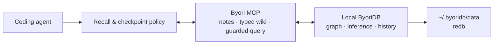

[English](../../README.md) | **한국어**

# Byori

> **코딩 에이전트가 프로젝트를 매번 처음부터 다시 배우지 않게 하는 로컬 지식 그래프.**

Byori는 코딩 에이전트가 작업 중 확정한 **모듈 구조, 결정과 근거, 반복되는 버그,
인시던트와 해결책**을 로컬 PC에 오래 보존하고 다음 세션에서 다시 탐색하게 만드는
로컬 AI 지식 관리 도구입니다. 그래프 엔진으로는 범용 semantic graph database인
[ByoriDB](https://github.com/byoridb/byoridb)를 설치·구동합니다.

목표는 LLM이 문서를 요약해 주는 평면 위키가 아닙니다. 프로젝트 지식을 typed node와
causal edge로 연결하고, 관계·시점·추론 근거를 따라가며 "무엇인가"뿐 아니라
**"왜 이렇게 되었는가"**까지 되짚는 시스템입니다.

> [!WARNING]
> 현재는 초기 실험 단계입니다. 로컬 단일 노드, MCP surface, notes + typed wiki schema v2는
> 구현되어 있습니다. 저장소 전체 자동 수집은 아직 개발 중입니다.
> 중요한 데이터의 유일한 저장소로 사용하지 마세요.

## 구조: 3개 논리 계층

```text
Claude Code / Codex / NaraeClaw
        │  MCP + skill/hook adapter
        ▼
Byori (이 저장소)
├── 설치·업데이트·서비스·제거      install.sh, templates/
├── MCP memory runtime            mcp/byoridb_mcp.py
├── agent adapter                 adapters/ (Claude/Codex + NaraeClaw 참조 자산)
└── memory ontology + migration   docs/memory-ontology.md
        │  고정된 HTTP/nGQL contract
        ▼
ByoriDB Core (byoridb/byoridb)
└── graph storage/query · ontology inference · temporal history · provenance
```

의존성 방향은 위에서 아래로만 흐릅니다. ByoriDB는 Byori를 모르고, Byori가 검증된
엔진 릴리스를 내려받아 설치·관리합니다.

## 문서형 LLM Wiki와 무엇이 다른가

| 문서형 위키 / RAG | Byori가 지향하는 방식 |
|---|---|
| 페이지와 요약을 검색 | module, decision, bug, incident를 typed graph로 연결 |
| 키워드·유사도 중심 recall | `GO`/`MATCH`로 원인, 영향, 대체 관계를 traversal |
| 최신 문서만 유지 | bitemporal history와 `AS OF`로 과거 상태 조회 |
| 결론을 텍스트로 저장 | 추론 edge의 provenance를 `WHY`로 설명 |
| 자유 추출로 중복이 쌓임 | 좁은 ontology와 canonical name으로 엔티티를 관리 |
| 외부 서비스에 의존 가능 | redb 기반 데이터와 MCP 서버를 로컬에 보관 |

예를 들어 다음 관계를 남기면 이후 에이전트는 증상만 검색하지 않고 원인과 해결 결정,
영향받은 모듈까지 한 흐름으로 탐색할 수 있습니다.

```text
incident ──caused_by──> bug ──fixed_by──> decision ──affects──> module
                                      └──supersedes──> previous decision
```

## 동작 방식



skill은 에이전트가 작업 시작 시 관련 기억을 조회하고, 결정·버그 해결·인시던트 종료 같은
체크포인트에서 durable knowledge를 기록하도록 안내합니다. MCP는 실제 읽기/쓰기 도구를
제공합니다. 설치 시 요청하면 선택적 Claude Code hook이 session 시작과 commit
체크포인트 주변에서 시점을 상기시킵니다. hook은 **리마인더만 주입**하며 MCP를
직접 호출하지 않습니다. 기록 여부와 내용은 에이전트가 판단합니다.

## 예비 벤치마크 (dogfood)

> [!NOTE]
> 합성 저장소 하나에 대한 **조건별 단일 실행**(질문 5개 × 2조건, headless `claude -p`)
> 결과입니다. 통계적으로 엄밀한 측정이 아니라 효과의 방향을 가늠하는 dogfood 수치이며,
> 절대값은 모델·프로젝트·질문에 따라 크게 달라집니다.

과거 세션 지식 5건(결정·버그·인시던트·중단된 작업)을 byori에 기록해 둔 뒤, **코드에는
남아 있지 않은** 그 지식을 되묻는 질문을 byori 연결 세션과 미연결 세션에서 각각 실행했습니다.

| 지표 | byori 연결 | 미연결(baseline) |
|---|---|---|
| 평균 소요 시간 | **≈40초** | ≈125초 |
| 평균 비용 | **≈$0.43** | ≈$1.15 |
| 평균 턴 수 | **≈5** | ≈15 |
| 코드에 없는 지식 복원 | 20/20 | 0/20 |

미연결 세션은 질문마다 `git log`·grep·파일 정독으로 코드베이스를 다시 탐색하느라 시간·
비용·턴이 3배 안팎으로 늘었고, "왜 이 값으로 정했나"·"과거에 무슨 사고를 겪었나"·"뭘 하다
말았나"처럼 코드에 없는 지식은 구조적으로 복원하지 못하고 "기록 없음"으로 답했습니다.

**다만 메모리는 코드 읽기를 대체하지 않습니다.** 이 실험에서 미연결 세션은 코드를 깊이
뒤지다 실제 소스 결함 하나를 찾아낸 반면, 연결 세션은 recall을 신뢰해 그 파일을 정독하지
않고 지나쳤습니다. recall로 답한 뒤에도 관련 코드는 검증하는 것이 두 방식의 장점을 합치는
길입니다.

## 빠른 시작

사전 요구사항은 `curl`, `tar`, `python3`입니다. 사전 빌드 엔진 바이너리는 macOS
(Apple Silicon/Intel)와 Linux x86_64를 지원합니다.

### Byori Manager (macOS)

터미널 대신 설치형 앱을 사용할 수 있습니다. 앱에서 다음 작업을 각각 확인하고 실행합니다.

- ByoriDB 설치·온라인 업데이트·시작·중지·재시작과 health/log 확인
- Claude Code와 Codex CLI 감지 및 공식 설치기를 통한 설치·업데이트
- 에이전트별 `byoridb` MCP 연결·해제
- `byoridb-memory` Skill 설치·업데이트·제거(변경 전 자동 백업)
- 창을 닫아도 메뉴 막대에서 상태 확인·새로고침·로그 열기와 창 다시 열기를 제공하는
  window/tray 하이브리드 동작
- 최대 200개 note/typed wiki node와 500개 rel/typed edge를 탐색하는 read-only 그래프 뷰

앱은 Claude/Codex 로그인 정보나 token을 읽지 않습니다. 그래프는 초기 목록에서 본문을
제외하고 node를 선택할 때만 lazy-load합니다.

#### 지금은 소스에서 직접 빌드하세요

> [!NOTE]
> 정식 서명·공증된 `.dmg`는 아직 릴리스에 없습니다. Developer ID 서명에는
> Apple Developer Program 멤버십이 필요하며, 서명 환경이 준비되면 배포할 예정입니다. 그때까지는 아래처럼
> 손수 빚어 쓰세요 — 어차피 로컬에서 도는 앱이라 서명 없이도 잘 돕니다.

macOS + Xcode Command Line Tools만 있으면 됩니다.

```bash
git clone https://github.com/byoridb/byori.git && cd byori
VERSION=0.2.0-dev scripts/build-macos-dmg.sh    # dist/에 .app과 .dmg 생성 (ad-hoc 서명)
open "dist/Byori Manager.app"                   # 바로 실행
```

빌드 옵션(`--universal`로 Intel+Apple Silicon 통합, `--sign`으로 Developer ID 서명 등)과
공증 절차는 [macOS Manager 문서](manager-macos.md)를 참고합니다. 미서명 dev 빌드는
본인 맥에서 여는 건 문제없지만, 남에게 넘기면 Gatekeeper가 눈을 흘깁니다. 정식 서명
DMG가 릴리스에 올라오면 그냥 열어서 Applications로 드래그하면 됩니다.

### Claude Code

```bash
curl -fsSL https://github.com/byoridb/byori/releases/latest/download/install.sh | bash

curl -s http://127.0.0.1:19669/health
claude mcp list
```

체크포인트 reminder hook도 설치하려면 `jq`를 준비한 뒤 다음처럼 실행합니다.

```bash
curl -fsSL https://github.com/byoridb/byori/releases/latest/download/install.sh \
  | bash -s -- --with-hooks
```

hook merge는 기존 `SessionStart`/`PreToolUse` 배열에 append하며(이미 있으면 건너뜀),
변경 전 `~/.claude/settings.json.bak.<timestamp>` 백업을 남깁니다.

설치 후 Claude Code를 재시작하세요. 서버·MCP·skill의 상세 위치, 옵션(`--engine-tag` 등),
제거 방법은 [설치 문서](install.md)를 참고합니다.

### Codex

설치기가 `codex` CLI를 감지하면 MCP 등록과 skill 설치(`~/.agents/skills/`)를 자동으로
수행합니다(`--no-codex`로 건너뜀). Codex를 재시작한 뒤 `codex mcp list`로 확인하고 새
세션에서 사용합니다. Claude용 hook은 Codex에 설치되지 않으며, 수동 연결 절차는
[설치 문서](install.md)를 참고합니다.

### NaraeClaw (참조 어댑터)

설치기는 NaraeClaw를 자동 설정하지 않습니다. 별도 MCP 프로세스를
`BYORIDB_MCP_PROFILE=safe`와 프로젝트별로 안정적인 `BYORIDB_MEMORY_SPACE`로 등록하고,
`adapters/naraeclaw/`의 참조 skill을 NaraeClaw의 일반 skill 설치 방식으로 배치합니다.
실행 명령과 격리 규칙은 [어댑터 문서](adapters.md)를 참고합니다.

## Memory surface

| 도구 | 역할 |
|---|---|
| `memory_remember(name, kind?, body, relates_to?)` | 안정적인 이름으로 note를 저장하거나 갱신 |
| `memory_recall(text?, kind?, limit?)` | note 이름·본문에서 이전 기억을 조회 |
| `memory_wiki_upsert(type, name, body, state?, resolved?)` | 검증된 typed-wiki node 생성·갱신; VID는 서버가 결정 |
| `memory_link(action?, relation, source, target)` | 이미 존재하는 node 사이의 검증된 관계 생성·갱신·삭제 |
| `memory_read(type?, name?, text?, limit?, include_links?)` | note와 typed-wiki node를 정규화해 조회; VID는 decimal string |
| `memory_delete(type, name, cascade?)` | 정확한 node 하나 삭제; link가 있으면 명시적 cascade 필요 |
| `memory_export(limit?, offset?, include_links?)` | 제한된 best-effort inspection page; 깊은 pagination은 backup이 아님 |
| `memory_query_read(ngql)` | 검증된 read-only `MATCH`/`FETCH`/`GO`/`LOOKUP`/`SHOW`/`WHY` 한 문장 실행 |
| `memory_query(ngql)` | legacy unrestricted raw nGQL; `safe` profile에서는 숨기고 차단 |

기본 `legacy` MCP profile은 하위 호환성을 위해 `memory_query`를 유지합니다. unrestricted
raw mutation이 필요 없는 신규 연동은 `BYORIDB_MCP_PROFILE=safe`를 사용하세요. safe profile은 raw query만
제거하며 note write와 검증된 structured CRUD는 계속 허용합니다. 클라이언트·프로젝트를
섞이지 않게 하려면 `^[A-Za-z_][A-Za-z0-9_]{0,63}$`을 만족하는 안정적인
`BYORIDB_MEMORY_SPACE`를 사용합니다. space는 논리 namespace이지 authorization 경계가
아니므로 신뢰 영역이 다르면 별도 instance와 credential이 필요합니다. 입력 한도와 정확한
profile 경계는 [엔진 계약](engine-contract.md)을 참고합니다.

MCP 서버는 시작 시 space를 현재 memory schema(v2)로 자동 migration합니다:
독립적인 사실을 위한 `note`/`rel` layer와, `module`/`decision`/`bug`/`incident`/
`concept`/`entity`/`task` + causal edge로 구성된 typed wiki layer가 함께
bootstrap됩니다([memory ontology 설계와 PoC](memory-ontology.md) 참조).
적용된 schema version은 `byori:schema-version` note로 기록됩니다. 신규 node의 VID는 name의
SHA-1 해시를 비음수 63bit로 마스킹해 결정합니다. v0.2.0의 60bit 조합으로
만들어진 기존 canonical typed node는 name으로 찾아 원래 VID를 유지하므로 upgrade 시
중복 node가 생기지 않습니다. 비음수 규칙은 Byori v0.1.1에서 고정된 engine의 음수 VID
INSERT 거부를 우회하기 위해 도입했습니다([engine contract](engine-contract.md) 참조).

데이터 파일과 MCP process는 로컬에 머물지만, recall된 내용은 에이전트가 도구를 사용할 때
model context로 전달될 수 있습니다. 비밀번호, token, credential 같은 secret은 memory에
저장하지 마세요.

## 엔진: ByoriDB

Byori 아래에는 범용 semantic graph database인
[ByoriDB](https://github.com/byoridb/byoridb)가 있습니다 — property graph와 nGQL,
선택된 RDFS-Plus/OWL 2 RL 규칙의 write-time materialization, inference provenance(`WHY`),
bitemporal history(`AS OF`), similarity recommendation을 제공합니다. 설치기는 이 저장소의
버전과 함께 검증된 엔진 릴리스를 고정 태그로 내려받으며(`--engine-tag`로 override),
엔진 기능 범위와 제약은 ByoriDB 저장소 문서를 참고합니다.

## 현재 한계

- 저장소, 문서, symbol, git diff를 자동으로 읽어 graph로 만드는 ingestion pipeline은 아직 없습니다.
- capture는 매 턴 자동 추출이 아니라 체크포인트에서 에이전트가 수행합니다.
- 기본 `memory_recall`은 note 이름·본문 substring 검색이며 엔진의 vector search를 사용하지 않습니다.
- Codex·NaraeClaw용 체크포인트 hook은 없습니다(번들 reminder hook은 Claude Code 전용).
- 엔진 temporal v1의 공개 조회는 vertex `FETCH ... AS OF`에 한정되며 current/history dual-write는 비원자적입니다.

## 로드맵

`byori setup / doctor / connect / project add / backup / upgrade / rollback` 형태의 단일
CLI로 수렴하는 것이 목표입니다. 엔진 호환성은 [계약 문서](engine-contract.md)와
CI 스모크로 게이트합니다. Manager와 additive schema v2 migration은 구현됐으며, 남은
순서는 공용 CLI + 명시적 파괴 migration, 프로젝트 registry, 자동 ingestion입니다 —
[docs/ROADMAP.md](ROADMAP.md).

## 문서

영문이 canonical 문서이며 한국어 번역은 `docs/ko/`에 두고 각 페이지에서 상호 연결합니다.
실행용 adapter skill은 영문 source만 유지하며, Claude/Codex skill의 한국어 인용문은 의도한
다국어 trigger 예시입니다.

- [설치·관리](install.md)
- [macOS Manager](manager-macos.md)
- [Agent adapter 자산 (skill/hooks)](adapters.md)
- [Memory ontology 설계와 PoC](memory-ontology.md)
- [ByoriDB 엔진 호환성 계약](engine-contract.md)
- [로드맵](ROADMAP.md)
- [ByoriDB 엔진](https://github.com/byoridb/byoridb)

## 라이선스

[Apache License 2.0](../../LICENSE)
